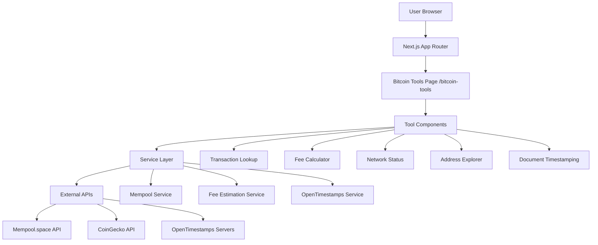

# Design Document

## Overview

Bitcoin Tools for Everyone is a standalone page that provides five core Bitcoin tools in a simplified, educational interface. The design prioritizes clarity, accessibility, and user education over technical completeness. The page will be built as a new route (`/bitcoin-tools`) within the existing Bitcoin Benefit Next.js application, leveraging existing infrastructure while maintaining independence from vesting-related features.

## Architecture

### High-Level Architecture



### Technology Stack Integration

The design will integrate with the existing Bitcoin Benefit technology stack:

- **Framework**: Next.js 14 with App Router (existing)
- **Styling**: Tailwind CSS with existing design system
- **State Management**: Zustand for tool-specific state
- **API Layer**: Extend existing API routes in `/api/mempool/`
- **Components**: Reuse existing UI components where appropriate
- **Icons**: Extend existing Heroicons usage

### Page Structure

```
/bitcoin-tools
├── Header Section (Hero + Navigation)
├── Tools Grid (5 main tools)
│   ├── Transaction Lookup Tool
│   ├── Fee Calculator Tool  
│   ├── Network Status Tool
│   ├── Address Explorer Tool
│   └── Document Timestamping Tool
├── Educational Footer
└── Privacy Notice
```

## Components and Interfaces

### Core Page Component

```typescript
// src/app/bitcoin-tools/page.tsx
interface BitcoinToolsPageProps {
  searchParams?: {
    tool?: string;
    txid?: string;
    address?: string;
  };
}

export default function BitcoinToolsPage({ searchParams }: BitcoinToolsPageProps)
```

### Tool Components Architecture

Each tool will be a self-contained component with consistent interface:

```typescript
interface ToolComponentProps {
  isExpanded?: boolean;
  onToggle?: () => void;
  initialData?: any;
}

interface ToolState {
  loading: boolean;
  error: string | null;
  data: any;
  userInput: string;
}
```

### 1. Transaction Lookup Component

```typescript
interface TransactionLookupProps extends ToolComponentProps {
  initialTxid?: string;
}

interface TransactionStatus {
  txid: string;
  status: 'pending' | 'confirmed' | 'failed';
  confirmations: number;
  blockHeight?: number;
  blockTime?: number;
  estimatedConfirmation?: string;
  fee: {
    total: number;
    rate: number;
    btc: number;
    usd: number;
  };
  humanReadable: {
    status: string;
    timeDescription: string;
    feeDescription: string;
  };
}
```

### 2. Fee Calculator Component

```typescript
interface FeeCalculatorProps extends ToolComponentProps {
  initialTxSize?: number;
}

interface FeeRecommendation {
  level: 'economy' | 'balanced' | 'priority';
  emoji: string;
  label: string;
  timeEstimate: string;
  satPerVByte: number;
  totalCost: {
    sats: number;
    btc: number;
    usd: number;
  };
  savings: {
    percent: number;
    usd: number;
  };
  description: string;
}
```

### 3. Network Status Component

```typescript
interface NetworkStatusProps extends ToolComponentProps {}

interface NetworkHealth {
  congestionLevel: 'low' | 'normal' | 'high' | 'extreme';
  mempoolSize: number;
  mempoolBytes: number;
  averageFee: number;
  nextBlockETA: string;
  recommendation: string;
  humanReadable: {
    congestionDescription: string;
    userAdvice: string;
    colorScheme: 'green' | 'yellow' | 'orange' | 'red';
  };
}
```

### 4. Address Explorer Component

```typescript
interface AddressExplorerProps extends ToolComponentProps {
  initialAddress?: string;
}

interface AddressInfo {
  address: string;
  balance: {
    btc: number;
    usd: number;
    sats: number;
  };
  transactionCount: number;
  transactions: SimplifiedTransaction[];
  humanReadable: {
    balanceDescription: string;
    activitySummary: string;
  };
}

interface SimplifiedTransaction {
  txid: string;
  date: string;
  type: 'received' | 'sent';
  amount: {
    btc: number;
    usd: number;
  };
  status: 'confirmed' | 'pending';
}
```

### 5. Document Timestamping Component

```typescript
interface DocumentTimestampingProps extends ToolComponentProps {}

interface TimestampResult {
  hash: string;
  timestamp: number;
  proofFile: Blob;
  verificationUrl: string;
  humanReadable: {
    timestampDescription: string;
    instructions: string[];
  };
}
```

## Data Models

### Unified Error Handling

```typescript
interface ToolError {
  type: 'validation' | 'network' | 'api' | 'unknown';
  message: string;
  userFriendlyMessage: string;
  suggestions: string[];
  retryable: boolean;
}
```

### Loading States

```typescript
interface LoadingState {
  isLoading: boolean;
  loadingMessage: string;
  progress?: {
    current: number;
    total: number;
    description: string;
  };
}
```

### Educational Content Model

```typescript
interface EducationalContent {
  term: string;
  definition: string;
  example?: string;
  learnMoreUrl?: string;
}
```

## Error Handling

### Error Boundary Strategy

```typescript
// Wrap each tool in its own error boundary
<ToolErrorBoundary toolName="Transaction Lookup">
  <TransactionLookupTool />
</ToolErrorBoundary>
```

### User-Friendly Error Messages

```typescript
const ERROR_MESSAGES = {
  INVALID_TXID: {
    message: "That doesn't look like a valid transaction ID",
    suggestions: [
      "Transaction IDs are 64 characters long",
      "They contain only letters (a-f) and numbers (0-9)",
      "Try copying the ID again from your wallet"
    ]
  },
  NETWORK_ERROR: {
    message: "We're having trouble connecting to the Bitcoin network",
    suggestions: [
      "Check your internet connection",
      "Try again in a few moments",
      "The Bitcoin network might be experiencing high traffic"
    ]
  }
};
```

## Testing Strategy

### Component Testing

```typescript
// Example test structure for each tool
describe('TransactionLookupTool', () => {
  it('validates transaction ID format');
  it('displays loading state during API calls');
  it('shows user-friendly error messages');
  it('formats transaction data for non-technical users');
  it('handles network failures gracefully');
});
```

### Integration Testing

```typescript
// Test API integration
describe('Mempool API Integration', () => {
  it('handles rate limiting gracefully');
  it('provides fallback data when APIs are down');
  it('caches responses appropriately');
});
```

### Accessibility Testing

```typescript
// Ensure tools work for all users
describe('Accessibility', () => {
  it('provides proper ARIA labels');
  it('supports keyboard navigation');
  it('works with screen readers');
  it('maintains proper color contrast');
});
```

### Mobile Testing

```typescript
// Mobile-specific functionality
describe('Mobile Experience', () => {
  it('adapts layout for small screens');
  it('uses appropriate input types');
  it('handles touch interactions');
  it('loads efficiently on slow connections');
});
```

## Performance Considerations

### Lazy Loading Strategy

```typescript
// Load tools on demand
const TransactionLookupTool = dynamic(() => import('./TransactionLookupTool'), {
  loading: () => <ToolSkeleton />,
  ssr: false
});
```

### Caching Strategy

```typescript
// Cache API responses
const CACHE_DURATIONS = {
  TRANSACTION_STATUS: 30, // seconds
  FEE_ESTIMATES: 60,
  NETWORK_STATUS: 10,
  ADDRESS_BALANCE: 120
};
```

### Bundle Optimization

- Code splitting by tool
- Tree shaking for unused utilities
- Image optimization for educational content
- Progressive loading for non-critical features

## Security Considerations

### Input Validation

```typescript
// Validate all user inputs
const validateTxid = (txid: string): boolean => {
  return /^[a-fA-F0-9]{64}$/.test(txid);
};

const validateAddress = (address: string): boolean => {
  // Use existing Bitcoin address validation
  return validateBitcoinAddress(address);
};
```

### Privacy Protection

```typescript
// Clear sensitive data
const clearUserData = () => {
  // Clear form inputs
  // Clear cached searches
  // Clear temporary files
};

// Privacy warnings
const PRIVACY_WARNINGS = {
  ADDRESS_LOOKUP: "Searching for an address will send it to public APIs",
  DOCUMENT_UPLOAD: "Documents are processed locally and not stored"
};
```

### Rate Limiting

```typescript
// Client-side rate limiting
class RateLimiter {
  private requests: number[] = [];
  private readonly maxRequests = 10;
  private readonly windowMs = 60000;

  canMakeRequest(): boolean {
    const now = Date.now();
    this.requests = this.requests.filter(time => now - time < this.windowMs);
    return this.requests.length < this.maxRequests;
  }
}
```

## Integration Points

### Existing API Routes

Extend current API structure:
```
/api/mempool/
├── address/[address]/txs (existing)
├── tx/[txid] (existing)
├── fees/recommended (new)
├── network/status (new)
└── timestamps/create (new)
```

### Shared Components

Reuse from existing codebase:
- Loading spinners
- Error boundaries
- Form inputs
- Button components
- Modal dialogs

### Navigation Integration

Add to existing navigation:
```typescript
// Add to main navigation
const navigationItems = [
  // ... existing items
  {
    name: 'Bitcoin Tools',
    href: '/bitcoin-tools',
    description: 'Simple Bitcoin blockchain tools'
  }
];
```

## Deployment Considerations

### Environment Variables

```typescript
// Add to existing env config
NEXT_PUBLIC_OPENTIMESTAMPS_SERVERS=alice.btc.calendar.opentimestamps.org,bob.btc.calendar.opentimestamps.org
NEXT_PUBLIC_ENABLE_BITCOIN_TOOLS=true
```

### Feature Flags

```typescript
// Allow gradual rollout
const FEATURE_FLAGS = {
  BITCOIN_TOOLS_ENABLED: process.env.NEXT_PUBLIC_ENABLE_BITCOIN_TOOLS === 'true',
  DOCUMENT_TIMESTAMPING: process.env.NEXT_PUBLIC_ENABLE_TIMESTAMPS === 'true'
};
```

This design provides a comprehensive foundation for building user-friendly Bitcoin tools while maintaining the educational focus and accessibility requirements outlined in the specifications.