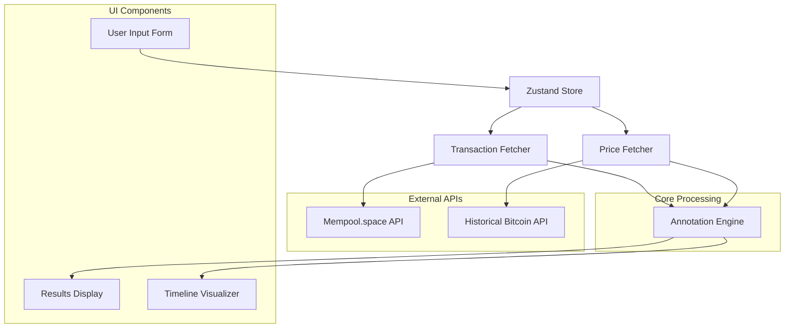

# Design Document

## Overview

The On-Chain Vesting Tracker is a sophisticated feature that bridges the gap between theoretical vesting calculations and real-world Bitcoin transactions. It provides users with the ability to verify their actual Bitcoin grants against their expected vesting schedule by analyzing on-chain transaction data and enriching it with historical price information.

The system follows a client-side architecture that fetches data from public APIs, processes it locally, and presents comprehensive analytics without storing any sensitive user data. The design leverages the existing project patterns including Zustand for state management, Recharts for visualization, and the established component architecture.

## Architecture

### High-Level Architecture



### Data Flow

1. **Input Collection**: User provides Bitcoin address, vesting start date, and annual grant amount
2. **Validation**: Client-side validation using Zod schemas
3. **Transaction Fetching**: Parallel API calls to Mempool.space for transaction history
4. **Price Fetching**: Historical price data retrieval for each transaction date
5. **Annotation Processing**: Smart matching algorithm to identify vesting grants
6. **Results Presentation**: Tabular and visual display of annotated transactions

### Technology Stack Integration

- **State Management**: Zustand store following existing patterns
- **Validation**: Zod schemas consistent with current validation approach
- **API Layer**: Dedicated service modules following existing bitcoin-api.ts patterns
- **Components**: React components using established styling and patterns
- **Visualization**: Recharts integration similar to existing VestingTimelineChart
- **Styling**: Tailwind CSS with dark mode support matching current design system

## Components and Interfaces

### Core Components

#### 1. OnChainTrackerPage (`src/app/on-chain/page.tsx`)
- **Purpose**: Main page component orchestrating the entire feature
- **Responsibilities**: Layout, error boundaries, privacy disclaimer
- **Integration**: Uses existing Navigation component and layout patterns

#### 2. VestingTrackerForm (`src/components/on-chain/VestingTrackerForm.tsx`)
- **Purpose**: Input collection and validation
- **Props Interface**:
```typescript
interface VestingTrackerFormProps {
  onSubmit: (data: TrackerFormData) => void;
  isLoading: boolean;
  errors: FormErrors;
}
```
- **Features**: Real-time validation, loading states, clear error messaging

#### 3. VestingTrackerResults (`src/components/on-chain/VestingTrackerResults.tsx`)
- **Purpose**: Display annotated transaction data
- **Props Interface**:
```typescript
interface VestingTrackerResultsProps {
  transactions: AnnotatedTransaction[];
  isLoading: boolean;
  error: string | null;
  onRetry: () => void;
}
```
- **Features**: Sortable table, transaction links, loading skeletons

#### 4. OnChainTimelineVisualizer (`src/components/on-chain/OnChainTimelineVisualizer.tsx`)
- **Purpose**: Visual timeline of expected vs actual grants
- **Props Interface**:
```typescript
interface OnChainTimelineVisualizerProps {
  expectedGrants: ExpectedGrant[];
  actualTransactions: AnnotatedTransaction[];
  vestingStartDate: string;
}
```
- **Features**: Interactive timeline, color-coded markers, hover details

#### 5. ManualAnnotationOverride (`src/components/on-chain/ManualAnnotationOverride.tsx`)
- **Purpose**: Allow users to manually adjust transaction annotations
- **Props Interface**:
```typescript
interface ManualAnnotationOverrideProps {
  transaction: AnnotatedTransaction;
  availableGrants: ExpectedGrant[];
  onUpdate: (txid: string, grantYear: number | null) => void;
}
```
- **Features**: Dropdown selection, undo functionality, visual feedback

### State Management

#### OnChain Store (`src/stores/onChainStore.ts`)

```typescript
interface OnChainState {
  // Form inputs
  address: string;
  vestingStartDate: string;
  annualGrantBtc: number;
  
  // Validation
  formErrors: FormErrors;
  
  // Core data
  rawTransactions: RawTransaction[];
  annotatedTransactions: AnnotatedTransaction[];
  expectedGrants: ExpectedGrant[];
  historicalPrices: Record<string, number>;
  
  // Manual overrides
  manualAnnotations: Map<string, number | null>;
  
  // UI state
  isLoading: boolean;
  error: string | null;
  currentStep: 'idle' | 'fetching' | 'annotating' | 'complete';
  
  // Actions
  setFormData: (data: Partial<TrackerFormData>) => void;
  validateAndFetch: () => Promise<void>;
  updateManualAnnotation: (txid: string, grantYear: number | null) => void;
  resetTracker: () => void;
}
```

### API Services

#### Mempool API Service (`src/lib/on-chain/mempool-api.ts`)

```typescript
export class MempoolAPI {
  static async fetchTransactions(address: string): Promise<RawTransaction[]>;
  static async fetchTransactionDetails(txid: string): Promise<TransactionDetails>;
  static validateAddress(address: string): boolean;
}
```

#### Historical Price Integration (`src/lib/on-chain/price-fetcher.ts`)

```typescript
export class OnChainPriceFetcher {
  static async fetchBatchPrices(dates: string[]): Promise<Record<string, number>>;
  static async fetchPriceForDate(date: string): Promise<number>;
  static optimizePriceRequests(transactions: RawTransaction[]): string[];
}
```

## Data Models

### Type Definitions (`src/types/on-chain.ts`)

```typescript
// Raw transaction from Mempool.space API
export interface RawTransaction {
  txid: string;
  status: {
    confirmed: boolean;
    block_height: number;
    block_time: number;
  };
  vin: Array<{
    prevout: {
      scriptpubkey_address: string;
      value: number;
    };
  }>;
  vout: Array<{
    scriptpubkey_address: string;
    value: number;
  }>;
  fee: number;
}

// Enriched transaction with annotation
export interface AnnotatedTransaction {
  txid: string;
  grantYear: number | null;
  type: 'Annual Grant' | 'Other Transaction';
  isIncoming: boolean;
  amountBTC: number;
  amountSats: number;
  date: string;
  blockHeight: number;
  valueAtTimeOfTx: number | null;
  status: 'Confirmed' | 'Unconfirmed';
  matchScore?: number;
  isManuallyAnnotated: boolean;
}

// Expected grant for matching
export interface ExpectedGrant {
  year: number;
  expectedDate: string;
  expectedAmountBTC: number;
  expectedAmountSats: number;
  isMatched: boolean;
  matchedTxid?: string;
  tolerance: {
    dateRangeDays: number;
    amountPercentage: number;
  };
}

// Form data structure
export interface TrackerFormData {
  address: string;
  vestingStartDate: string;
  annualGrantBtc: number;
}

// Validation errors
export interface FormErrors {
  address?: string;
  vestingStartDate?: string;
  annualGrantBtc?: string;
  general?: string;
}

// Annotation algorithm configuration
export interface AnnotationConfig {
  dateWeight: number; // 0.4
  amountWeight: number; // 0.6
  matchThreshold: number; // 0.75
  maxDateToleranceDays: number; // 90
  maxAmountTolerancePercent: number; // 20
}
```

### Validation Schemas (`src/lib/on-chain/validation.ts`)

```typescript
import { z } from 'zod';

export const bitcoinAddressSchema = z.string()
  .min(26, 'Bitcoin address too short')
  .max(62, 'Bitcoin address too long')
  .refine(validateBitcoinAddress, 'Invalid Bitcoin address format');

export const trackerFormSchema = z.object({
  address: bitcoinAddressSchema,
  vestingStartDate: z.string()
    .refine(date => !isNaN(Date.parse(date)), 'Invalid date format')
    .refine(date => new Date(date) <= new Date(), 'Start date cannot be in the future'),
  annualGrantBtc: z.number()
    .positive('Annual grant must be positive')
    .max(21, 'Annual grant cannot exceed 21 BTC')
    .refine(amount => amount >= 0.00000001, 'Minimum grant is 1 satoshi')
});
```

## Error Handling

### Error Categories

1. **Validation Errors**: Client-side input validation failures
2. **Network Errors**: API connectivity issues
3. **API Errors**: External service failures or rate limiting
4. **Processing Errors**: Annotation algorithm failures
5. **Data Errors**: Malformed or unexpected API responses

### Error Handling Strategy

```typescript
// Centralized error handling
export class OnChainErrorHandler {
  static handleValidationError(error: ZodError): FormErrors;
  static handleNetworkError(error: Error): string;
  static handleAPIError(error: APIError): string;
  static handleProcessingError(error: Error): string;
  static shouldRetry(error: Error): boolean;
}

// Error recovery mechanisms
export interface ErrorRecovery {
  retryable: boolean;
  fallbackData?: any;
  userAction?: 'retry' | 'modify_input' | 'contact_support';
  message: string;
}
```

### Graceful Degradation

- **Partial Data Display**: Show available data even if some API calls fail
- **Fallback Pricing**: Use approximate prices if historical data unavailable
- **Manual Override**: Allow users to manually annotate when automatic matching fails
- **Offline Indicators**: Clear messaging when services are unavailable

## Testing Strategy

### Unit Testing

#### Core Logic Tests (`src/lib/on-chain/__tests__/`)

1. **Annotation Algorithm** (`annotateTransactions.test.ts`)
   - Perfect match scenarios
   - Near-miss scenarios (slightly off date/amount)
   - No-match scenarios
   - Edge cases (duplicate amounts, same dates)
   - Manual override integration

2. **API Services** (`mempool-api.test.ts`, `price-fetcher.test.ts`)
   - Successful API responses
   - Error handling and retries
   - Data transformation accuracy
   - Rate limiting behavior

3. **Validation Logic** (`validation.test.ts`)
   - Bitcoin address validation
   - Form input validation
   - Edge case handling

#### Store Testing (`src/stores/__tests__/onChainStore.test.ts`)

- State transitions
- Action dispatching
- Error state management
- Manual annotation updates
- Form validation integration

### Component Testing

#### Form Components
- Input validation feedback
- Loading state display
- Error message presentation
- Accessibility compliance

#### Results Components
- Data rendering accuracy
- Loading skeleton display
- Empty state handling
- Interactive features (sorting, filtering)

#### Visualization Components
- Chart rendering with various data sets
- Interactive hover states
- Responsive behavior
- Color accessibility

### Integration Testing

#### End-to-End User Flows
1. **Happy Path**: Valid input → successful fetch → accurate annotation → results display
2. **Error Scenarios**: Invalid input → API failures → recovery mechanisms
3. **Manual Override**: Automatic annotation → manual adjustment → updated results
4. **Edge Cases**: Empty transaction history → large transaction sets → network interruptions

#### API Integration Tests
- Mock external APIs for consistent testing
- Test rate limiting and retry logic
- Validate data transformation pipelines
- Test error propagation and handling

### Performance Testing

#### Load Testing
- Large transaction sets (1000+ transactions)
- Multiple concurrent API requests
- Memory usage with extensive data
- UI responsiveness during processing

#### Optimization Validation
- API request batching effectiveness
- Caching mechanism performance
- Component re-render optimization
- Bundle size impact

## Security Considerations

### Data Privacy

1. **No Server Storage**: All processing happens client-side
2. **API Transparency**: Clear disclosure of external API usage
3. **Minimal Data Exposure**: Only necessary data sent to APIs
4. **Session-Only Storage**: No persistent storage of sensitive data

### Input Validation

1. **Address Validation**: Comprehensive Bitcoin address format checking
2. **Injection Prevention**: Sanitize all user inputs
3. **Rate Limiting**: Respect API rate limits to prevent abuse
4. **Error Information**: Avoid exposing sensitive system information

### API Security

1. **HTTPS Only**: All external API calls use secure connections
2. **No API Keys**: Use public APIs to avoid key exposure
3. **Request Validation**: Validate all API responses before processing
4. **Timeout Handling**: Prevent hanging requests

## Performance Optimization

### API Optimization

1. **Request Batching**: Combine multiple price requests into single calls
2. **Concurrent Requests**: Parallel processing where possible
3. **Caching Strategy**: Cache historical prices within session
4. **Request Deduplication**: Avoid duplicate API calls for same data

### UI Performance

1. **Lazy Loading**: Load components as needed
2. **Virtual Scrolling**: Handle large transaction lists efficiently
3. **Memoization**: Optimize expensive calculations
4. **Debounced Inputs**: Prevent excessive validation calls

### Memory Management

1. **Data Cleanup**: Clear large datasets when not needed
2. **Component Unmounting**: Proper cleanup of event listeners
3. **Memory Monitoring**: Track memory usage in development
4. **Garbage Collection**: Optimize object lifecycle management

## Accessibility

### WCAG Compliance

1. **Keyboard Navigation**: Full keyboard accessibility
2. **Screen Reader Support**: Proper ARIA labels and descriptions
3. **Color Contrast**: Meet WCAG AA standards
4. **Focus Management**: Clear focus indicators and logical tab order

### Inclusive Design

1. **Error Messaging**: Clear, actionable error descriptions
2. **Loading States**: Accessible loading indicators
3. **Data Tables**: Proper table headers and navigation
4. **Visual Indicators**: Non-color-dependent status indicators

## Future Enhancements

### Phase 2 Features

1. **xpub Support**: Extended public key transaction aggregation
2. **Advanced Filtering**: Date ranges, amount filters, transaction types
3. **Export Functionality**: CSV/PDF export of results
4. **Comparison Mode**: Compare multiple addresses or time periods

### Phase 3 Features

1. **Multi-Address Tracking**: Portfolio-level vesting analysis
2. **Alert System**: Notifications for new grants or milestones
3. **Integration APIs**: Connect with popular Bitcoin wallets
4. **Advanced Analytics**: Statistical analysis and projections

### Technical Improvements

1. **Offline Support**: Service worker for offline functionality
2. **Progressive Enhancement**: Enhanced features for modern browsers
3. **Performance Monitoring**: Real-time performance tracking
4. **A/B Testing**: Feature flag system for gradual rollouts