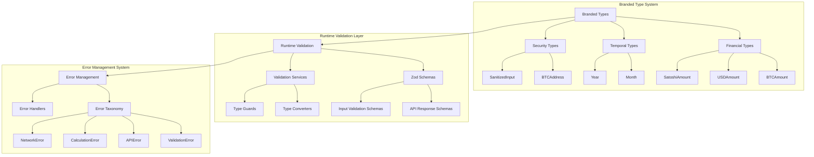
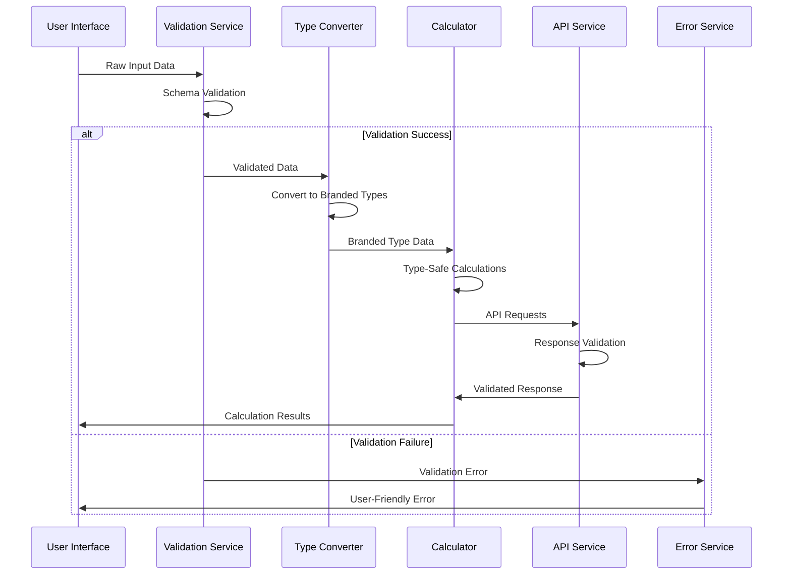
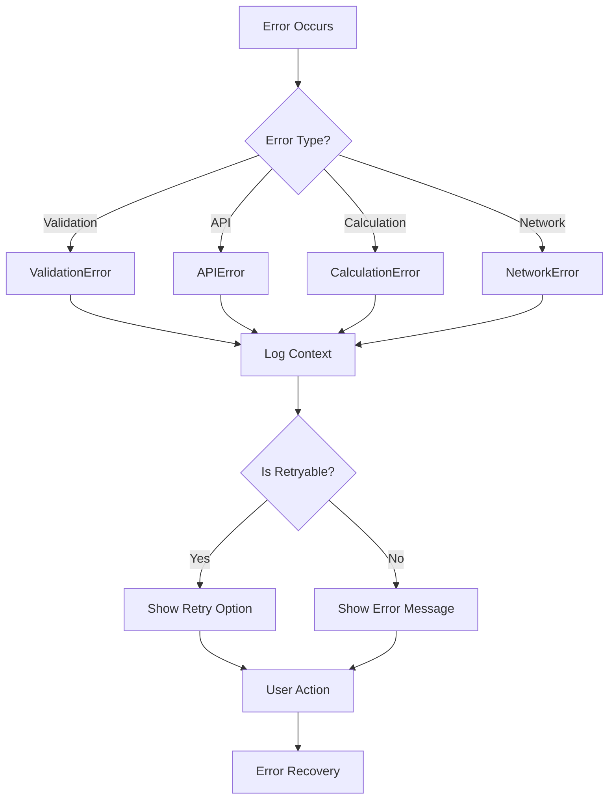

# Design Document

## Overview

This design implements comprehensive TypeScript improvements for the Bitcoin compensation plan application, focusing on type safety, runtime validation, and developer experience enhancements. The solution introduces branded types for financial values, runtime schema validation with Zod, a comprehensive error taxonomy system, enhanced temporal type safety, and optimized build configuration.

The design follows a layered approach where type safety is enforced at compile-time through branded types and enhanced at runtime through schema validation, with comprehensive error handling providing clear feedback throughout the application stack.

## Architecture

### Core Type System Architecture



### Data Flow Architecture



## Components and Interfaces

### 1. Branded Type System

#### Financial Type Definitions
```typescript
// Core branded types for financial values
export type BTCAmount = number & { 
  readonly __brand: 'BTC';
  readonly __constraint: 'positive';
};

export type USDAmount = number & { 
  readonly __brand: 'USD';
  readonly __constraint: 'positive';
};

export type SatoshiAmount = number & { 
  readonly __unit: 'SATS';
  readonly __constraint: 'positive';
};

// Type conversion utilities
export interface CurrencyConverter {
  btcToSatoshis(btc: BTCAmount): SatoshiAmount;
  satoshisToBTC(sats: SatoshiAmount): BTCAmount;
  btcToUSD(btc: BTCAmount, price: USDAmount): USDAmount;
  validateBTCAmount(value: number): BTCAmount;
  validateUSDAmount(value: number): USDAmount;
  validateSatoshiAmount(value: number): SatoshiAmount;
}
```

#### Temporal Type Definitions
```typescript
// Temporal branded types with constraints
export type Month = number & { 
  readonly __brand: 'Month';
  readonly __constraint: 'range:1-120';
};

export type Year = number & { 
  readonly __brand: 'Year';
  readonly __constraint: 'range:2009-2050';
};

export type ValidDateString = string & { 
  readonly __brand: 'ValidDate';
};

// Temporal validation utilities
export interface TemporalValidator {
  validateMonth(value: number): Month;
  validateYear(value: number): Year;
  validateDateString(value: string): ValidDateString;
  isValidVestingPeriod(months: Month): boolean;
  isValidBitcoinYear(year: Year): boolean;
}
```

#### Security Type Definitions
```typescript
// Security-focused branded types
export type BTCAddress = string & { 
  readonly __brand: 'BTCAddress';
  readonly __validated: true;
};

export type SanitizedInput<T> = T & { 
  readonly __sanitized: true;
};

// Security validation interface
export interface SecurityValidator {
  validateBitcoinAddress(input: string): BTCAddress;
  sanitizeStringInput(input: string): SanitizedInput<string>;
  sanitizeNumericInput(input: number): SanitizedInput<number>;
}
```

### 2. Runtime Validation System

#### Zod Schema Definitions
```typescript
// Bitcoin API response schema
export const BitcoinPriceResponseSchema = z.object({
  bitcoin: z.object({
    usd: z.number().positive('Price must be positive'),
    usd_24h_change: z.number('24h change must be a number')
  })
});

// Mempool API transaction schema
export const RawTransactionSchema = z.object({
  txid: z.string().length(64, 'Invalid transaction ID length'),
  status: z.object({
    confirmed: z.boolean(),
    block_height: z.number().int().positive(),
    block_time: z.number().int().positive()
  }),
  vin: z.array(z.object({
    prevout: z.object({
      scriptpubkey_address: z.string().min(1),
      value: z.number().int().nonnegative()
    })
  })),
  vout: z.array(z.object({
    scriptpubkey_address: z.string().min(1),
    value: z.number().int().nonnegative()
  })),
  fee: z.number().int().nonnegative()
});

// Vesting calculation input schema
export const CalculationInputsSchema = z.object({
  scheme: z.object({
    id: z.string().min(1),
    name: z.string().min(1),
    initialGrant: z.number().positive('Initial grant must be positive'),
    annualGrant: z.number().positive().optional(),
    vestingSchedule: z.array(z.object({
      months: z.number().int().min(1).max(120),
      grantPercent: z.number().min(0).max(100)
    }))
  }),
  currentBitcoinPrice: z.number().positive('Bitcoin price must be positive'),
  projectedBitcoinGrowth: z.number('Growth rate must be a number')
});
```

#### Validation Service Interface
```typescript
export interface ValidationService {
  validateBitcoinPriceResponse(data: unknown): BitcoinPriceResponse;
  validateTransactionData(data: unknown): RawTransaction;
  validateCalculationInputs(data: unknown): CalculationInputs;
  validateFormData(data: unknown): TrackerFormData;
  sanitizeAndValidate<T>(data: unknown, schema: z.ZodSchema<T>): T;
}
```

### 3. Error Management System

#### Error Taxonomy
```typescript
// Base error class with categorization
export abstract class BitcoinVestingError extends Error {
  abstract readonly category: 'validation' | 'api' | 'calculation' | 'network';
  abstract readonly isRetryable: boolean;
  abstract readonly userMessage: string;
  abstract readonly context: Record<string, unknown>;
  
  constructor(message: string) {
    super(message);
    this.name = this.constructor.name;
  }
}

// Specific error implementations
export class ValidationError extends BitcoinVestingError {
  readonly category = 'validation';
  readonly isRetryable = false;
  readonly userMessage: string;
  readonly context: ValidationContext;
  
  constructor(message: string, context: ValidationContext) {
    super(message);
    this.userMessage = `Invalid input: ${message}`;
    this.context = context;
  }
}

export class APIError extends BitcoinVestingError {
  readonly category = 'api';
  readonly isRetryable: boolean;
  readonly userMessage: string;
  readonly context: APIContext;
  
  constructor(
    message: string, 
    context: APIContext,
    isRetryable: boolean = false
  ) {
    super(message);
    this.isRetryable = isRetryable;
    this.userMessage = isRetryable 
      ? 'Service temporarily unavailable. Please try again.'
      : 'Unable to fetch data. Please check your connection.';
    this.context = context;
  }
}

export class CalculationError extends BitcoinVestingError {
  readonly category = 'calculation';
  readonly isRetryable = false;
  readonly userMessage: string;
  readonly context: CalculationContext;
  
  constructor(message: string, context: CalculationContext) {
    super(message);
    this.userMessage = `Calculation failed: ${message}`;
    this.context = context;
  }
}
```

#### Error Context Interfaces
```typescript
export interface ValidationContext {
  field: string;
  value: unknown;
  expectedType: string;
  constraints?: Record<string, unknown>;
}

export interface APIContext {
  endpoint: string;
  statusCode?: number;
  requestData?: Record<string, unknown>;
  responseData?: unknown;
}

export interface CalculationContext {
  operation: string;
  inputs: Record<string, unknown>;
  intermediateResults?: Record<string, unknown>;
}
```

### 4. Performance Tracking System

#### Performance Metrics Types
```typescript
export interface PerformanceMetrics {
  readonly calculationTimeMs: number;
  readonly memoryUsageMB: number;
  readonly cacheHitRate: number;
  readonly apiCallCount: number;
  readonly validationTimeMs: number;
}

export type OptimizedCalculation<T> = T & {
  readonly performanceMetrics: PerformanceMetrics;
  readonly cacheKey: string;
  readonly timestamp: number;
};

export interface PerformanceTracker {
  startTracking(operation: string): PerformanceSession;
  endTracking(session: PerformanceSession): PerformanceMetrics;
  getCacheMetrics(): CacheMetrics;
  getMemoryUsage(): number;
}
```

### 5. Testing Enhancement System

#### Test Fixture Types
```typescript
export interface VestingTestScenario {
  readonly name: string;
  readonly description: string;
  readonly inputs: CalculationInputs;
  readonly expectedOutputs: Partial<VestingCalculationResult>;
  readonly tolerances: TestTolerances;
  readonly tags: string[];
}

export interface TestTolerances {
  readonly financialTolerance: number; // Percentage tolerance for financial calculations
  readonly timeTolerance: number; // Days tolerance for date calculations
  readonly percentageTolerance: number; // Tolerance for percentage calculations
}

export interface TestFixtureGenerator {
  generateVestingScenarios(): VestingTestScenario[];
  generateAPIResponseFixtures(): Record<string, unknown>;
  generateErrorScenarios(): ErrorTestScenario[];
  generatePerformanceTestCases(): PerformanceTestCase[];
}
```

## Data Models

### Enhanced Type Definitions

#### Updated Vesting Types
```typescript
// Enhanced vesting scheme with branded types
export interface EnhancedVestingScheme {
  id: string;
  name: string;
  description: string;
  initialGrant: BTCAmount;
  annualGrant?: BTCAmount;
  vestingSchedule: EnhancedVestingMilestone[];
  bonuses?: EnhancedVestingBonus[];
}

export interface EnhancedVestingMilestone {
  months: Month;
  grantPercent: number;
  description: string;
}

export interface EnhancedCalculationInputs {
  scheme: EnhancedVestingScheme;
  currentBitcoinPrice: USDAmount;
  projectedBitcoinGrowth: number;
}

export interface EnhancedVestingTimelinePoint {
  month: Month;
  employeeBalance: BTCAmount;
  employerBalance: BTCAmount;
  vestedAmount: BTCAmount;
  totalBalance: BTCAmount;
  bitcoinPrice: USDAmount;
  usdValue: USDAmount;
}
```

#### Enhanced On-Chain Types
```typescript
// Enhanced transaction types with branded values
export interface EnhancedAnnotatedTransaction {
  txid: string;
  grantYear: Year | null;
  type: 'Annual Grant' | 'Other Transaction';
  isIncoming: boolean;
  amountBTC: BTCAmount;
  amountSats: SatoshiAmount;
  date: ValidDateString;
  blockHeight: number;
  valueAtTimeOfTx: USDAmount | null;
  status: 'Confirmed' | 'Unconfirmed';
  matchScore?: number;
  isManuallyAnnotated: boolean;
}

export interface EnhancedTrackerFormData {
  address: BTCAddress;
  vestingStartDate: ValidDateString;
  annualGrantBtc: BTCAmount;
}
```

## Error Handling

### Error Handling Strategy

The error handling system implements a comprehensive taxonomy that categorizes errors by type, provides appropriate user messages, and determines retry behavior. Each error includes context information for debugging and user-friendly messages for display.

#### Error Flow Architecture


#### Error Handler Implementation
```typescript
export class ErrorHandler {
  static handle(error: unknown): ErrorResponse {
    if (error instanceof BitcoinVestingError) {
      return {
        category: error.category,
        message: error.userMessage,
        isRetryable: error.isRetryable,
        context: error.context,
        timestamp: new Date().toISOString()
      };
    }
    
    // Handle unexpected errors
    return {
      category: 'unknown',
      message: 'An unexpected error occurred. Please try again.',
      isRetryable: true,
      context: { originalError: String(error) },
      timestamp: new Date().toISOString()
    };
  }
  
  static logError(error: BitcoinVestingError): void {
    console.error(`[${error.category.toUpperCase()}] ${error.message}`, {
      context: error.context,
      stack: error.stack,
      timestamp: new Date().toISOString()
    });
  }
}
```

## Testing Strategy

### Testing Architecture

The testing strategy focuses on type safety validation, runtime schema testing, error scenario coverage, and performance benchmarking. Test fixtures provide comprehensive scenarios for different calculation types and edge cases.

#### Test Categories
1. **Type Safety Tests**: Verify branded type constraints and conversions
2. **Schema Validation Tests**: Test runtime validation with various input scenarios
3. **Error Handling Tests**: Verify error categorization and user message generation
4. **Performance Tests**: Benchmark calculation performance and memory usage
5. **Integration Tests**: Test end-to-end workflows with real data

#### Test Implementation Structure
```typescript
// Type safety test utilities
export class TypeSafetyTester {
  static testBrandedTypes(): void {
    // Test BTCAmount constraints
    expect(() => validateBTCAmount(-1)).toThrow(ValidationError);
    expect(() => validateBTCAmount(0)).toThrow(ValidationError);
    expect(validateBTCAmount(1.5)).toEqual(1.5);
  }
  
  static testTemporalConstraints(): void {
    // Test Month constraints
    expect(() => validateMonth(0)).toThrow(ValidationError);
    expect(() => validateMonth(121)).toThrow(ValidationError);
    expect(validateMonth(12)).toEqual(12);
  }
}

// Schema validation test utilities
export class SchemaValidationTester {
  static testAPIResponseValidation(): void {
    const validResponse = { bitcoin: { usd: 45000, usd_24h_change: 2.5 } };
    const invalidResponse = { bitcoin: { usd: -1000 } };
    
    expect(() => BitcoinPriceResponseSchema.parse(validResponse)).not.toThrow();
    expect(() => BitcoinPriceResponseSchema.parse(invalidResponse)).toThrow();
  }
}
```

### Performance Testing Framework
```typescript
export class PerformanceTester {
  static async benchmarkCalculation(
    inputs: CalculationInputs,
    iterations: number = 1000
  ): Promise<PerformanceBenchmark> {
    const startTime = performance.now();
    const startMemory = process.memoryUsage().heapUsed;
    
    for (let i = 0; i < iterations; i++) {
      VestingCalculator.calculate(inputs);
    }
    
    const endTime = performance.now();
    const endMemory = process.memoryUsage().heapUsed;
    
    return {
      averageTimeMs: (endTime - startTime) / iterations,
      memoryDeltaMB: (endMemory - startMemory) / 1024 / 1024,
      iterations,
      timestamp: new Date().toISOString()
    };
  }
}
```

This design provides a comprehensive foundation for implementing the TypeScript Pro improvements while maintaining backward compatibility and ensuring robust error handling throughout the application.