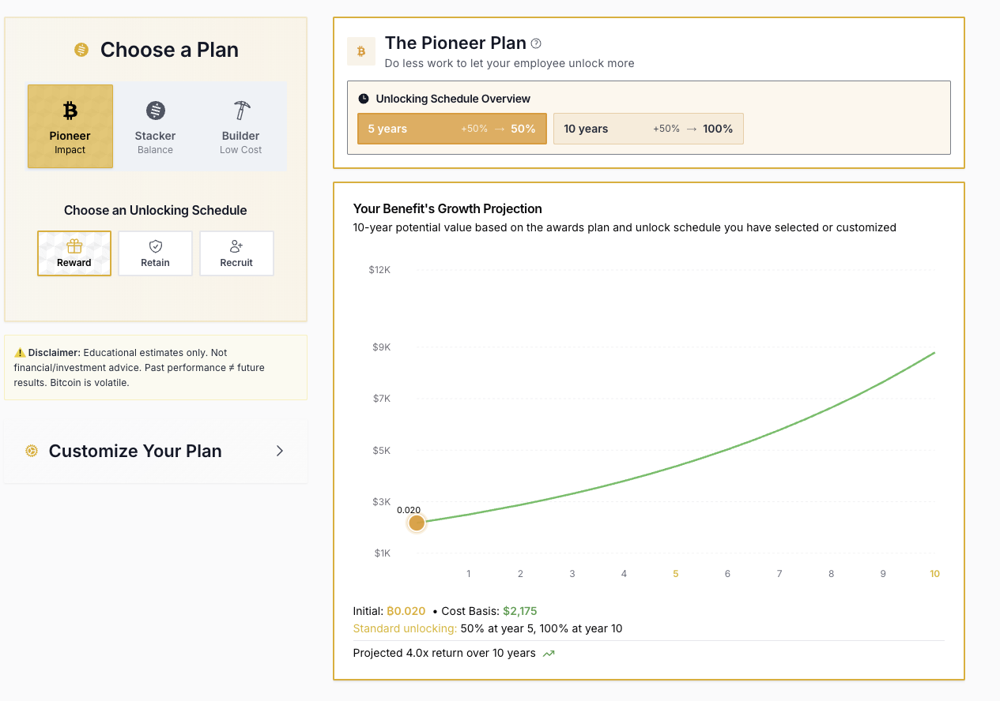
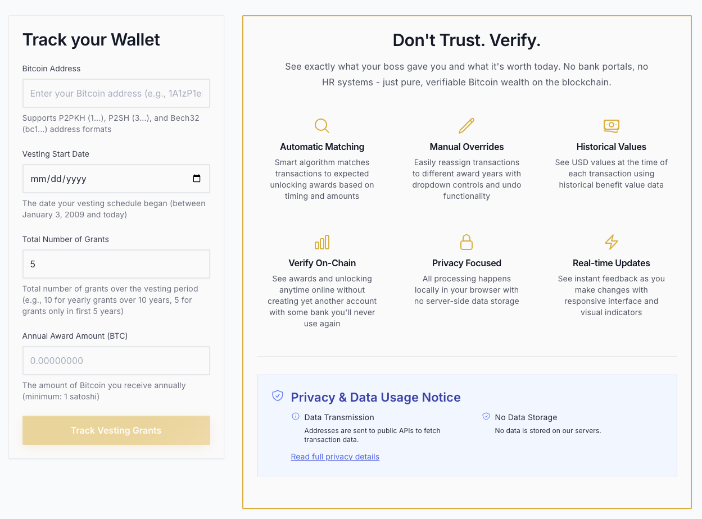
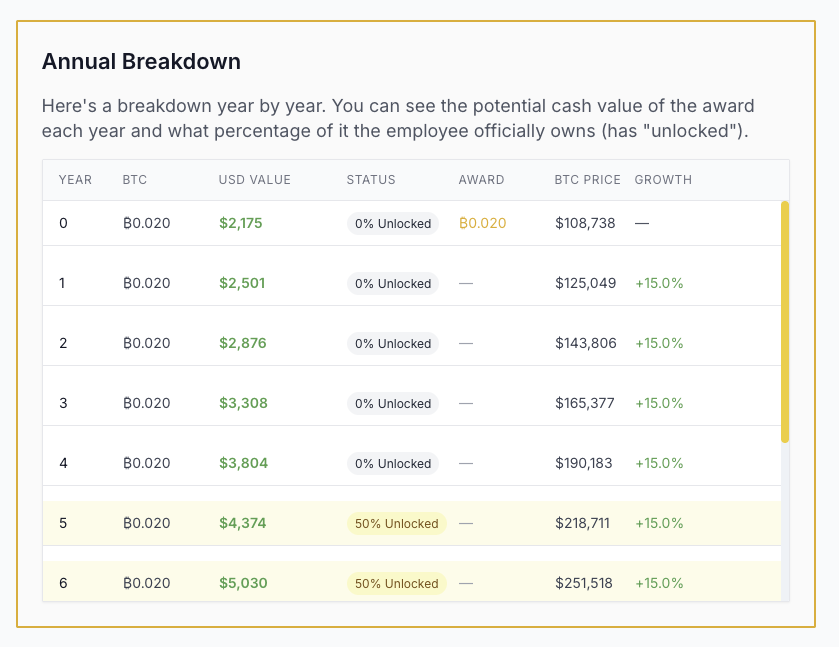
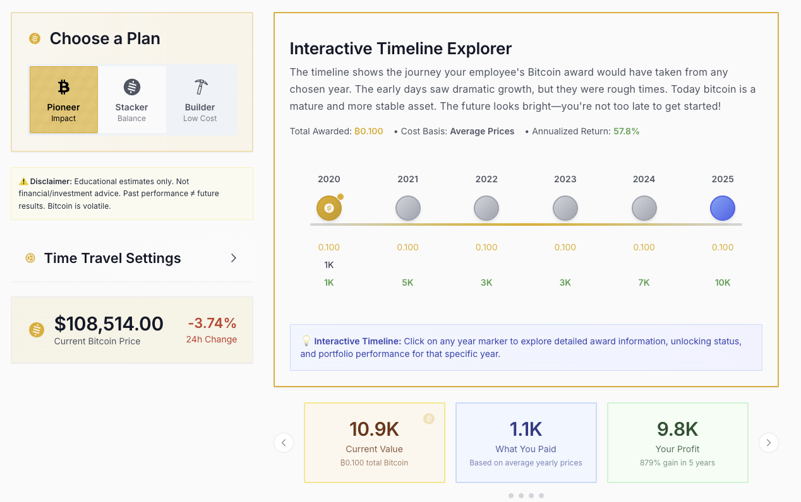

# Bitcoin Benefits White Paper
## Empowering Small Businesses with Bitcoin-Based Employee Compensation

**Version 1.0 | January 2025**

---

## Executive Summary

Bitcoin Benefits is a revolutionary platform that enables small businesses to implement Bitcoin-based employee compensation packages with unprecedented simplicity and transparency. In an era of persistent inflation, diminishing purchasing power, and complex traditional benefits administration, we provide a streamlined solution that aligns long-term employee incentives with the revolutionary potential of Bitcoin.

Our platform addresses a critical gap in the market: while large corporations have sophisticated compensation tools and crypto-forward companies offer Bitcoin payroll options, small businesses lack accessible, compliant, and user-friendly platforms to offer Bitcoin as a structured long-term benefit. Bitcoin Benefits democratizes access to Bitcoin compensation through intuitive planning tools, transparent vesting calculators, and blockchain-verified tracking systems.

By leveraging Bitcoin's unique properties—scarcity, decentralization, and proven appreciation history—we enable businesses to offer benefits that have historically outperformed traditional retirement vehicles by orders of magnitude. Our platform transforms Bitcoin from a speculative asset into a structured, trackable, and manageable employee benefit that can drive retention, attract talent, and potentially create life-changing wealth for employees.

---

## The Problem: Traditional Benefits Are Failing Small Businesses and Their Employees

### The Broken Promise of Traditional Benefits

The traditional employee benefits landscape is fundamentally broken for small businesses and their employees:

**Inflation Erosion**: Traditional 401(k) plans and pensions, while offering tax advantages, struggle to maintain purchasing power against persistent inflation. The average 401(k) return of 7-10% annually barely outpaces real inflation when accounting for housing, healthcare, and education costs.

**Complexity and Cost**: Small businesses face prohibitive costs and administrative burdens when implementing traditional benefits. Setup fees, ongoing administration, compliance requirements, and fiduciary responsibilities create barriers that leave 48% of small businesses unable to offer any retirement benefits.

**Limited Accessibility**: Traditional investment vehicles require minimum contributions, have strict withdrawal penalties, and involve complex vesting schedules that are difficult for employees to understand and track. Young employees especially find these vehicles unappealing and disconnected from their financial goals.

**Lack of Transparency**: Employees often cannot easily verify their benefits, track vesting schedules, or understand the true value of their compensation packages. This opacity reduces the perceived value of benefits and diminishes their effectiveness as retention tools.

### The Crypto Payroll Gap

While cryptocurrency payroll solutions exist, they focus primarily on immediate payment rather than long-term structured benefits:

- Current solutions emphasize instant conversion and spending
- No platforms specifically designed for vesting schedules and long-term holding
- Lack of tools for modeling future value and tracking historical performance
- Missing integration with traditional HR and benefits workflows
- Absence of educational resources for employers and employees

### Small Business Disadvantage

Small businesses face unique challenges that our platform directly addresses:

- **Resource Constraints**: Limited HR staff and benefits expertise
- **Budget Limitations**: Cannot afford enterprise-grade benefits platforms
- **Competitive Disadvantage**: Struggle to attract talent against larger companies
- **Retention Challenges**: Lack tools to create compelling long-term incentives
- **Innovation Barriers**: Want to offer cutting-edge benefits but lack implementation pathways

---

## The Bitcoin Case: Why Bitcoin Represents the Ultimate Employee Benefit

### Proven Track Record Since 2009

Bitcoin has demonstrated extraordinary resilience and growth over 16 years:

- **Historical Performance**: From $0.001 to over $100,000, representing unprecedented wealth creation
- **Market Maturation**: Evolution from experimental technology to institutional asset class
- **Network Effects**: Growing adoption by corporations, governments, and financial institutions
- **Infrastructure Development**: Robust ecosystem of exchanges, custodians, and financial products

### Fundamental Properties That Create Value

**Absolute Scarcity**: The 21 million Bitcoin supply cap creates digital scarcity unprecedented in human history. Unlike fiat currencies subject to infinite printing or gold with expanding supply through mining, Bitcoin's supply is mathematically fixed.

**Decentralization**: No single entity controls Bitcoin, making it resistant to manipulation, censorship, or debasement. This property ensures that employee benefits cannot be arbitrarily devalued by corporate or government actions.

**Programmable Money**: Bitcoin's transparent blockchain enables perfect verification of vesting schedules, automatic execution of grants, and immutable record-keeping without intermediaries.

**Global Accessibility**: Bitcoin operates 24/7/365 across all borders, providing employees with a truly portable benefit that moves with them regardless of employer or location.

### Inflation Hedge and Store of Value

Bitcoin has emerged as "digital gold" with superior properties:

- **Portability**: Entire wealth transportable via memorized seed phrase
- **Divisibility**: Fractional ownership down to 100 millionth of a Bitcoin
- **Verifiability**: Instant authentication without third-party validation
- **Durability**: Immune to physical degradation or loss when properly secured

### Addressing Volatility Concerns

We acknowledge Bitcoin's volatility and address it through:

**Long-term Perspective**: Vesting schedules of 4-10 years smooth volatility through time averaging. Every 4-year period in Bitcoin's history has shown positive returns.

**Dollar-Cost Averaging**: Regular grant schedules naturally implement DCA strategies, reducing timing risk and smoothing entry prices.

**Educational Resources**: Comprehensive materials help employees understand volatility as opportunity rather than risk when holding long-term.

**Conservative Projections**: Our calculators use modest growth assumptions (15-50% annually) compared to historical performance (200%+ CAGR), providing realistic expectations.

---

## Solution: The Bitcoin Benefits Platform

### Platform Overview

Bitcoin Benefits provides a comprehensive suite of tools that transform Bitcoin from a speculative asset into a structured employee benefit:

**Planning Tools**: Interactive calculators allowing businesses to model different vesting schemes, project costs, and visualize long-term outcomes for employees.

**Vesting Management**: Transparent tracking of vesting schedules with blockchain verification, ensuring employees can independently verify their benefits.

**Educational Resources**: Comprehensive guides for implementing Bitcoin benefits, discussing with employees, setting up custody solutions, and maintaining compliance.

**Historical Analysis**: Tools showing actual performance of hypothetical vesting schemes, demonstrating Bitcoin's track record to skeptical stakeholders.

### Three Proven Vesting Models

Our platform offers three carefully designed vesting models that balance risk, reward, and retention:

#### The Pioneer Plan
*For early adopters and high-impact employees*

- **Structure**: Large immediate grant (0.02 BTC) with aggressive vesting
- **Vesting**: 50% at year 5, 100% at year 10
- **Philosophy**: Reward early believers with potentially life-changing upside
- **Ideal For**: Startups, key executives, early employees



#### The Stacker Plan
*Balanced approach for sustainable growth*

- **Structure**: Initial grant (0.015 BTC) plus annual additions (0.001 BTC)
- **Vesting**: Graduated schedule with annual unlocking
- **Philosophy**: Combine immediate incentive with ongoing accumulation
- **Ideal For**: Growing companies, mid-level employees, retention focus

#### The Builder Plan
*Long-term accumulation strategy*

- **Structure**: Smaller annual grants (0.002 BTC) over 10 years
- **Vesting**: Each grant vests over 4 years
- **Philosophy**: Sustainable, budget-friendly approach with compound benefits
- **Ideal For**: Established businesses, broad employee programs, cost-conscious

### Implementation Workflow

Our platform guides businesses through a proven implementation process:

#### Step 1: Education and Buy-in
- Present Bitcoin benefits concept to leadership
- Share historical performance data and projections
- Address concerns about volatility and compliance
- Build consensus around program structure

#### Step 2: Program Design
- Select vesting model (Pioneer, Stacker, or Builder)
- Customize vesting schedules and amounts
- Define eligibility criteria and cliffs
- Set program budget and Bitcoin acquisition strategy

#### Step 3: Technical Setup
- Establish custody solution (self-custody, multi-sig, or third-party)
- Create secure key management procedures
- Implement backup and recovery processes
- Set up monitoring and reporting systems

#### Step 4: Employee Communication
- Announce program with educational materials
- Conduct information sessions explaining Bitcoin
- Provide individual benefit projections
- Establish ongoing support channels

#### Step 5: Execution and Tracking
- Execute initial Bitcoin purchases
- Timestamp grants on blockchain
- Provide employees with tracking tools
- Maintain transparent vesting records



---

## Vesting and Benefit Models

### Understanding Bitcoin Vesting

Vesting creates alignment between employee tenure and benefit value, crucial for retention and long-term thinking:

**Time-Based Vesting**: Benefits unlock based on employment duration, creating "golden handcuffs" that encourage retention while building wealth.

**Cliff Vesting**: Initial waiting period before any benefits vest, protecting employers from short-term employees while rewarding commitment.

**Graduated Vesting**: Progressive unlocking that balances employee liquidity needs with retention incentives.

**Performance Vesting**: Tie unlocking to company or individual milestones, aligning Bitcoin rewards with business success.

### Real-World Case Study

Consider an employee receiving $100 monthly in Bitcoin benefits under the Stacker plan:

**Year 1-4**: Accumulation Phase
- Monthly purchases build Bitcoin position
- No vesting creates anticipation and retention
- Employee watches portfolio grow
- Education reduces anxiety about volatility

**Year 5**: First Vesting Event
- 50% of accumulated Bitcoin unlocks
- Employee gains liquid wealth while remaining incentivized
- Tangible reward validates program
- Remaining unvested amount encourages continued employment

**Year 6-10**: Graduated Unlocking
- Annual vesting provides regular rewards
- Employee becomes long-term Bitcoin holder
- Wealth accumulation accelerates with price appreciation
- Success stories drive program expansion



### Customization and Flexibility

Our platform enables complete customization:

- **Grant Amounts**: From 0.00001 to 1+ BTC per grant
- **Vesting Periods**: 1 to 20 years with monthly precision
- **Cliff Periods**: 0 to 5 years
- **Vesting Curves**: Linear, accelerated, or back-weighted
- **Trigger Events**: Time, performance, or milestone-based

---

## Technology and Security

### Architecture and Privacy

Bitcoin Benefits prioritizes security and privacy through thoughtful architecture:

**Client-Side Processing**: All calculations and projections run locally in users' browsers, ensuring sensitive compensation data never leaves their control.

**No Data Storage**: We don't store employee information, wallet addresses, or compensation details. Each session is ephemeral and private.

**Public API Integration**: Real-time Bitcoin prices from reputable sources (CoinGecko, Mempool.space) ensure accurate valuations without compromising privacy.

**Open Source Transparency**: Our codebase is auditable, allowing security researchers and businesses to verify our privacy claims.

### Custody Recommendations

While Bitcoin Benefits doesn't custody funds, we provide comprehensive guidance:

#### Self-Custody Solutions
- **Hardware Wallets**: Recommended devices and setup procedures
- **Multi-Signature**: Detailed guides for 2-of-3 and 3-of-5 setups
- **Key Management**: Best practices for generation, storage, and backup
- **Recovery Planning**: Inheritance and succession procedures

#### Third-Party Custody
- **Unchained Capital**: Our recommended partner for collaborative custody
- **Qualified Custodians**: Evaluated providers for regulatory compliance
- **Insurance Considerations**: Coverage options and limitations
- **Audit Requirements**: Verification and reporting procedures

### Blockchain Integration

Our platform leverages blockchain for transparency and verification:

**Transaction Timestamping**: Immutable proof of grant dates and amounts using Bitcoin's OP_RETURN field or timestamp servers.

**Address Monitoring**: Real-time balance tracking and vesting calculations based on blockchain data.

**Verification Tools**: Employees can independently verify grants using any blockchain explorer.

**Smart Contract Integration**: Future compatibility with Bitcoin smart contracts (via Stacks, RSK, or Lightning).



---

## Compliance and Legal Considerations

### Regulatory Framework

Bitcoin Benefits provides general guidance while recommending professional consultation:

#### Tax Implications
- **Grant Taxation**: Generally taxable as ordinary income at vesting
- **Basis Tracking**: Importance of documenting purchase prices
- **Capital Gains**: Long-term holding benefits after vesting
- **Reporting Requirements**: Forms W-2, 1099-MISC, and 1099-B considerations

#### Employment Law
- **ERISA Considerations**: Bitcoin benefits typically outside ERISA scope
- **State Regulations**: Varying requirements across jurisdictions
- **International Employees**: Cross-border complexity and solutions
- **Documentation Requirements**: Proper agreements and disclosures

#### Accounting Treatment
- **Fair Value Measurement**: ASC 718 and share-based compensation
- **Expense Recognition**: Vesting period allocation
- **Disclosure Requirements**: Financial statement considerations
- **Audit Procedures**: Verification and testing approaches

### Best Practices and Risk Management

**Written Policies**: Comprehensive documentation of program terms, procedures, and responsibilities.

**Employee Agreements**: Clear contracts outlining vesting terms, tax responsibilities, and forfeiture conditions.

**Regular Reviews**: Annual assessment of regulatory changes and program compliance.

**Professional Guidance**: Partnerships with legal and tax professionals specializing in cryptocurrency.

---

## Growth Potential Calculator Methodology

### Conservative Projection Model

Our calculators use deliberately conservative assumptions:

**Base Growth Rate**: 15-50% annually compared to Bitcoin's historical 200%+ CAGR

**Volatility Adjustment**: Reduced projections during bear markets and corrections

**Cycle Awareness**: Four-year halving cycles incorporated into long-term models

**Risk Scenarios**: Multiple projection ranges from pessimistic to optimistic

### Historical Validation

We validate projections against actual performance:


**Backtesting Results**: Every 4-year period profitable since 2013

**Worst-Case Analysis**: Maximum drawdowns and recovery periods

**Comparative Performance**: Bitcoin vs. S&P 500, gold, and real estate

**Inflation Adjustment**: Real returns accounting for currency debasement

### Transparency and Disclaimers

We maintain complete transparency about projections:

- Clear labeling of estimates vs. guarantees
- Historical volatility disclosure
- Downside risk scenarios
- Regular model updates based on market conditions
- Educational resources on Bitcoin cycles and volatility

---

## Business Model

### Mission-Driven Approach

Bitcoin Benefits operates as a public good for Bitcoin adoption:

**Non-Profit Philosophy**: We don't seek profits from the platform itself, focusing instead on ecosystem growth and Bitcoin adoption.

**Open Source Commitment**: Our code is freely available for modification and self-hosting, ensuring no vendor lock-in.

**Community Development**: Contributions from Bitcoin enthusiasts and businesses improve the platform for everyone.

**Educational Mission**: Free resources, guides, and tools advance Bitcoin understanding and adoption.

### Sustainability Model

While not profit-seeking, we ensure platform sustainability through:

**Voluntary Donations**: Bitcoin tips and contributions from grateful users

**Consultation Services**: Optional paid guidance for complex implementations

**Partnership Referrals**: Relationships with custody providers and service vendors

**Grant Funding**: Applications to Bitcoin development funds and foundations

**Community Support**: Volunteer developers and content creators

---

## Future Roadmap

### Near-Term Development (2025)

**Enhanced Calculators**: More sophisticated modeling with Monte Carlo simulations and stress testing

**Mobile Applications**: Native iOS and Android apps for employee benefit tracking

**API Development**: Programmatic access for HR system integration

**Multi-Language Support**: Translations for global accessibility

### Medium-Term Vision (2026-2027)

**Lightning Integration**: Instant micropayments and reduced transaction costs

**DeFi Compatibility**: Yield generation on vesting Bitcoin through wrapped tokens

**Enterprise Features**: Advanced reporting, compliance tools, and multi-entity support

**AI Assistant**: Natural language interface for program design and employee support

### Long-Term Innovation (2028+)

**Sovereign Rollups**: Dedicated Bitcoin sidechain for benefits management

**Biometric Security**: Advanced authentication for benefit access

**Regulatory Automation**: Real-time compliance monitoring and reporting

**Global Standards**: Industry-standard protocols for Bitcoin benefits

---

## Conclusion

Bitcoin Benefits represents more than a platform—it's a movement to democratize access to the world's most revolutionary monetary technology. By transforming Bitcoin from a speculative investment into a structured employee benefit, we enable small businesses to compete for talent, reward loyalty, and potentially create generational wealth for their employees.

The convergence of Bitcoin's maturation, regulatory clarity, and institutional adoption creates a unique window of opportunity. Businesses that implement Bitcoin benefits today position themselves as forward-thinking employers while potentially providing employees with life-changing financial outcomes.

Our mission is simple yet profound: bring Bitcoin into mainstream employee benefits. We invite businesses to join us in this mission, whether as early adopters, partners, or contributors to our open-source platform.

The future of employee compensation is being written in code, secured by cryptography, and distributed across a global network. Bitcoin Benefits ensures that small businesses and their employees aren't left behind in this financial revolution.

**Join us in building a more equitable, transparent, and valuable future for employee benefits.**

---

## Appendices

### Appendix A: Glossary of Terms

**Bitcoin (BTC)**: The native currency of the Bitcoin network, divisible to 8 decimal places (100 million satoshis per Bitcoin)

**Blockchain**: A distributed ledger recording all Bitcoin transactions in chronological order

**Cliff**: A minimum employment period before any vesting occurs

**Cold Storage**: Offline storage of Bitcoin private keys for enhanced security

**DCA (Dollar-Cost Averaging)**: Investment strategy of regular purchases regardless of price

**Halving**: Programmatic reduction in Bitcoin mining rewards every 4 years

**Hash Rate**: Computational power securing the Bitcoin network

**HODL**: Long-term holding strategy originating from a misspelled "hold"

**Multi-Signature (Multi-sig)**: Wallet requiring multiple keys to authorize transactions

**Private Key**: Secret cryptographic key controlling Bitcoin ownership

**Public Key**: Cryptographic key for receiving Bitcoin (basis for addresses)

**Satoshi (sat)**: Smallest unit of Bitcoin (0.00000001 BTC)

**Seed Phrase**: Human-readable backup of private keys (typically 12-24 words)

**UTXO**: Unspent Transaction Output, Bitcoin's accounting model

**Vesting**: Process by which employees earn rights to employer-provided benefits over time

**Wallet**: Software or hardware for storing and managing Bitcoin

### Appendix B: Technical Implementation Details

#### API Integration Specifications

**CoinGecko API**:
- Endpoint: `https://api.coingecko.com/api/v3/simple/price`
- Rate Limit: 10-50 calls/minute (tier dependent)
- Caching Strategy: 5-minute TTL with fallback values

**Mempool.space API**:
- Endpoint: `https://mempool.space/api/address/{address}`
- Real-time WebSocket subscriptions available
- No authentication required for public data

#### Security Best Practices

**Key Generation**:
```
1. Use hardware random number generator
2. Generate in air-gapped environment
3. Verify entropy exceeds 256 bits
4. Create redundant backups immediately
```

**Multi-Signature Setup**:
```
2-of-3 Configuration:
- Key 1: Company treasury (cold storage)
- Key 2: Employee (hardware wallet)
- Key 3: Third-party arbiter (attorney/trustee)
```

#### Calculation Formulas

**Future Value Projection**:
```
FV = PV × (1 + r)^n
Where:
- FV = Future Value
- PV = Present Value (current BTC price)
- r = Annual growth rate (0.15 to 0.50)
- n = Number of years
```

**Vesting Schedule**:
```
Vested Amount = Total Grant × min(1, (Time Elapsed - Cliff) / Vesting Period)
```

### Appendix C: Legal Disclaimers

**Investment Risk Disclosure**:
Bitcoin is a volatile, experimental asset. Past performance does not guarantee future results. Bitcoin benefits may lose value, potentially to zero. Employees should not invest more than they can afford to lose and should seek independent financial advice.

**Regulatory Compliance**:
This white paper provides general information only and does not constitute legal, tax, or financial advice. Businesses must consult qualified professionals regarding their specific circumstances and jurisdictions.

**Platform Limitations**:
Bitcoin Benefits provides calculation and tracking tools only. We do not custody funds, execute trades, or provide investment advice. Users are responsible for their own Bitcoin security and tax obligations.

**No Warranty**:
The platform is provided "as is" without warranties of any kind. We do not guarantee accuracy, completeness, or suitability for any particular purpose.

### Appendix D: Resources and Support

**Official Website**: [bitcoinbenefits.me](https://bitcoinbenefits.me)

**Documentation**: Comprehensive guides at [docs.bitcoinbenefits.me](https://bitcoinbenefits.me/learn)

**GitHub Repository**: [github.com/bitcoinbenefits](https://github.com/yourusername/bitcoin_benefit)

**Community Support**: 
- Email: support@bitcoinbenefits.me
- Telegram: @bitcoinbenefits
- Twitter: @btcbenefits

**Recommended Partners**:
- **Custody**: Unchained Capital (Austin, TX)
- **Legal**: Cryptocurrency Law Group
- **Accounting**: Bitcoin Tax Professionals
- **Education**: Bitcoin Academy

**Educational Resources**:
- "The Bitcoin Standard" by Saifedean Ammous
- "Mastering Bitcoin" by Andreas Antonopoulos
- Bitcoin.org educational portal
- MIT OpenCourseWare: Blockchain and Money

---

*© 2025 Bitcoin Benefits. This document is released under Creative Commons CC-BY-SA 4.0 license. Feel free to share, adapt, and build upon this work with attribution.*

---

**Document Version**: 1.0  
**Last Updated**: January 2025  
**Next Review**: July 2025

---

*"The future of money is not being decided in boardrooms or government buildings—it's being written in code, secured by mathematics, and distributed across the world. Bitcoin Benefits ensures that future includes everyone."*